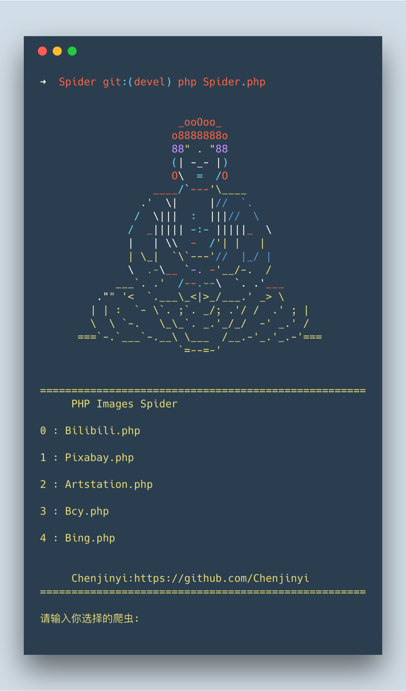

# PHP-Images-Spider

> 继Image-Spider又一个图片爬虫

前项目[Chenjinyi](https://github.com/Chenjinyi)/[Image-spider](https://github.com/Chenjinyi/Image-spider) 

## 简介



​	本爬虫只是我用来下载好看的图片的 Rua

​	使用了PHP Curl扩展 可在 PHP官方手册中查询

## 使用方法

```shell
#克隆库
git clone git@github.com:Chenjinyi/PHP-Images-Spider.git
#进入文件夹
cd PHP-Images-Spider
#运行爬虫（需有PHP环境）
php spider.php
#按命令行提示输入相应的数字
```

​	更详细的教程能在 Wiki 中找到（还没写）

## 能爬取的网站：

​	bilibili-相册

​	pixabay

​    artstation

   Bing每日壁纸

~~半次元~~ 网站改版 无法爬取，新版本开发中

……（后续添加）

## 关于项目开发环境

 	本地开发环境：PHP 7.2.8

​				   Macos 10.13

## 关于开发

​	欢迎各位push fork 

​	关于更多可以在 Wiki 中找到（还没写）

## 更多爬虫

[Images-Spider 图片爬虫 原（Bcy-Spider）](https://github.com/Chenjinyi/Image-spider)

[TaoBao-Spider 淘宝爬虫](https://github.com/Chenjinyi/solid-computing-machine/tree/master/taobao-spider)

[Huaban-Spider 花瓣爬虫](https://github.com/Chenjinyi/solid-computing-machine/tree/master/huaban-spider)

[PHP-Images-Spider 一个新的PHP爬虫](https://github.com/Chenjinyi/PHP-Images-Spider)


Email ：chenjinyi666@gmail.com
